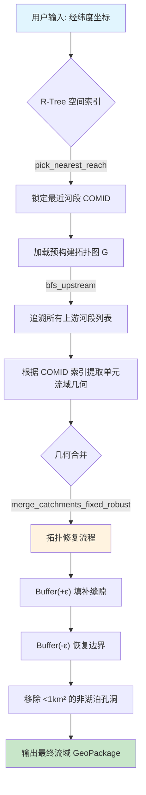
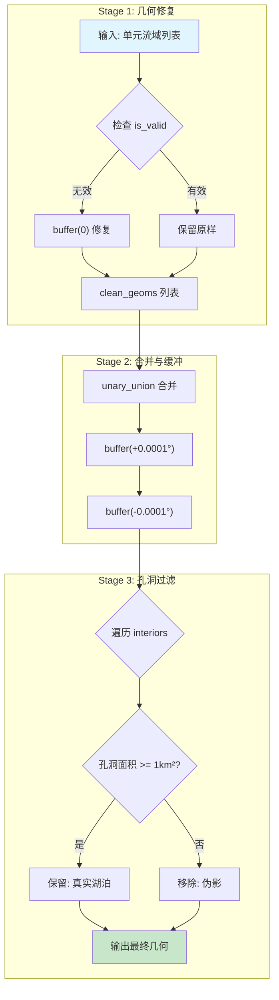

# Advanced Guide | 高级指南

> 🔧 深入理解 MERIT Watershed Extractor 的算法原理、参数调优和高级用法

本文档面向有一定 GIS 和 Python 基础的用户，提供算法流程图解、参数调优手册和复杂场景的解决方案。

---

## 📖 目录

1. [算法流程图解](#算法流程图解)
2. [核心数据结构](#核心数据结构)
3. [参数调优手册](#参数调优手册)
4. [复杂场景解决方案](#复杂场景解决方案)
5. [性能优化建议](#性能优化建议)
6. [故障排除指南](#故障排除指南)

---

## 算法流程图解

### 整体处理流程



### BFS 上游追溯流程

```mermaid
graph LR
    subgraph "BFS 算法"
        S[初始化: visited={outlet}, queue=[outlet]] --> A
        A{队列非空?} -->|是| B[取出队首节点 cur]
        B --> C[获取 cur 的上游集合]
        C --> D{遍历每个上游 u}
        D -->|u 未访问| E[visited.add u, queue.append u]
        D -->|u 已访问| F[跳过]
        E --> A
        F --> A
        A -->|否| G[返回 visited]
    end
    
    style S fill:#e3f2fd
    style G fill:#c8e6c9
```

### 拓扑修复三阶段



---

## 核心数据结构

### 1. 上游拓扑图 (Upstream Graph)

```python
# 数据结构: Dict[int, Set[int]]
# 键: 下游河段 COMID
# 值: 该河段所有上游 COMID 的集合

G = {
    103: {101, 102},  # 河段 103 有两个上游: 101 和 102
    105: {103, 104},  # 河段 105 有两个上游: 103 和 104
    101: set(),       # 源头河段没有上游
    102: set(),
    104: set()
}
```

**为什么用 Set 而不是 List?**
- 自动去重，避免重复边
- O(1) 成员测试（检查某河段是否为上游）
- 无序性符合拓扑关系的语义

### 2. 单元流域索引

```python
# 使用 COMID 作为索引，加速查找
gdf_cat = gdf_cat.set_index("COMID", drop=False)

# 通过 COMID 列表批量获取几何
comids = [101, 102, 103]
geometries = gdf_cat.loc[comids, 'geometry'].values
```

---

## 参数调优手册

### 场景化参数推荐

| 场景 | `buffer_dist` | `min_hole_km2` | 说明 |
|------|---------------|----------------|------|
| **标准处理** | 0.0001° | 1.0 | 适用于大多数 MERIT-Basins 数据 |
| **高精度边界** | 0.00005° | 0.5 | 对边界形状精度要求高 |
| **数据质量差** | 0.0002-0.0005° | 1.0 | 缝隙较大的数据集 |
| **湖泊丰富区** | 0.0001° | 0.1 | 青藏高原、东北湿地等 |
| **激进清理** | 0.0003° | 1000.0 | 只需要外边界 |

### 详细参数说明

#### `snap_dist_m` (捕捉距离，米)

控制站点坐标到河网的最大搜索距离。

```yaml
# config.yaml
snap_dist_m: 5000.0  # 默认 5 公里
```

**调优建议**:
- 山区河网稀疏: 增大至 10000-15000
- 平原河网密集: 减小至 2000-3000
- 如果报错"没有河段"，尝试增大此值

#### `order_first` (河流等级优先)

控制河段选择策略。

```yaml
order_first: false  # 默认: 距离优先
```

- `true`: 优先选择高等级河流（主河道），即使距离稍远
- `false`: 优先选择最近的河段，不考虑等级

**使用场景**:
- 主干流站点（如长江干流）: `true`
- 支流或山区站点: `false`

#### `max_up_reach` (最大上游河段数)

防止处理超大流域时内存溢出。

```yaml
max_up_reach: 100000  # 默认 10 万
```

**调优建议**:
- 全球大河（长江、亚马逊）: 200000-500000
- 中小流域: 10000-50000
- 测试阶段: 减小以加快迭代

#### `area_tol` (面积容忍度)

计算面积与参考面积的允许相对误差。

```yaml
area_tol: 0.20  # 默认 20%
```

- 高精度需求: 减至 0.10 (10%)
- 粗略验证: 增至 0.30-0.50

---

## 复杂场景解决方案

### 场景 A: 我只想要长江干流，不要细小的支流流域

**问题**: 站点坐标可能捕捉到岸边的小溪而非主河道。

**解决方案**: 

```yaml
# config.yaml
order_first: true  # 优先捕捉高等级河流
```

这会让算法优先选择河流等级（order）最高的河段，而不是距离最近的。

### 场景 B: 湖区湖泊被误删

**问题**: 青藏高原或东北湿地区域的小湖泊被当作伪影删除。

**解决方案**:

```python
from merit_extractor import merge_catchments_fixed_robust

# 调整参数，保留更小的湖泊
cat_geom = merge_catchments_fixed_robust(
    geometries,
    buffer_dist=0.0001,
    min_hole_km2=0.1  # 保留 > 0.1 km² 的湖泊
)
```

### 场景 C: 跨多个 pfaf 区域的超大流域

**问题**: 黑龙江跨越中俄多个 pfaf 区域，需要合并多个数据文件。

**解决方案**:

```python
import geopandas as gpd
import pandas as pd

# 读取并合并多个区域的河网数据
riv_files = [
    "riv_pfaf_2_MERIT_Hydro_v07_Basins_v01.shp",
    "riv_pfaf_4_MERIT_Hydro_v07_Basins_v01.shp"
]

gdfs = [gpd.read_file(f) for f in riv_files]
gdf_riv_merged = gpd.GeoDataFrame(pd.concat(gdfs, ignore_index=True))

# 同样合并单元流域
cat_files = [
    "cat_pfaf_2_MERIT_Hydro_v07_Basins_v01.shp",
    "cat_pfaf_4_MERIT_Hydro_v07_Basins_v01.shp"
]
gdfs_cat = [gpd.read_file(f) for f in cat_files]
gdf_cat_merged = gpd.GeoDataFrame(pd.concat(gdfs_cat, ignore_index=True))
gdf_cat_merged = gdf_cat_merged.set_index("COMID", drop=False)
```

### 场景 D: 处理后仍有小孔洞

**问题**: 即使用了鲁棒合并，结果中仍有一些小孔洞。

**解决方案**:

增大 buffer 距离：

```python
cat_geom = merge_catchments_fixed_robust(
    geometries,
    buffer_dist=0.0002,  # 增大到约 22 米
    min_hole_km2=1.0
)
```

如果仍有问题，可能是数据质量问题，考虑使用更大的 buffer：

```python
buffer_dist=0.0005  # 约 55 米
```

---

## 性能优化建议

### 1. I/O 优化

**问题**: Shapefile 读取速度慢。

**解决方案**: 转换为 GeoParquet 格式

```python
# 一次性转换
gdf = gpd.read_file("large_dataset.shp")
gdf.to_parquet("large_dataset.parquet")

# 后续快速读取
gdf = gpd.read_parquet("large_dataset.parquet")
```

GeoParquet 优势:
- 列式存储，压缩率高
- 读取速度快 3-10 倍
- 支持 predicate pushdown

### 2. 并行处理

当前工具已支持 `ProcessPoolExecutor` 并行处理多个站点。

```yaml
# 调整 worker 数量
# 默认: min(CPU核心数-1, 4)
```

对于内存受限的系统，减少 worker 数量：

```python
n_workers = 2  # 减少并行度，降低内存峰值
```

### 3. 内存管理

```yaml
memory_check_interval: 50  # 每 50 个站点检查内存
```

对于大批量处理:
- 监控内存使用，必要时增加检查频率
- 处理完每个站点后显式调用 `gc.collect()`

---

## 故障排除指南

### 常见错误及解决方案

| 错误信息 | 原因 | 解决方案 |
|----------|------|----------|
| `在 X m 内没有河段` | 站点离河网太远 | 增大 `snap_dist_m` |
| `河网数据缺少拓扑字段` | 数据不完整 | 使用完整的 MERIT-Basins 数据 |
| `内存不足` | 流域太大 | 减小 `max_up_reach` 或增加系统内存 |
| `输出几何无效` | 拓扑修复失败 | 增大 `buffer_dist` |

### 诊断脚本

```python
# 检查数据质量
def diagnose_data(gdf_riv, gdf_cat):
    print(f"河网数据:")
    print(f"  行数: {len(gdf_riv)}")
    print(f"  列: {list(gdf_riv.columns)}")
    print(f"  CRS: {gdf_riv.crs}")
    
    print(f"\n单元流域数据:")
    print(f"  行数: {len(gdf_cat)}")
    print(f"  COMID 唯一值: {gdf_cat['COMID'].nunique()}")
    
    # 检查拓扑字段
    topo_fields = ['NextDownID', 'up1', 'up2', 'up3', 'up4']
    available = [f for f in topo_fields if f in gdf_riv.columns]
    print(f"\n可用拓扑字段: {available}")
```

---

## 参考资料

- [MERIT-Basins 官方文档](http://hydro.iis.u-tokyo.ac.jp/~yamadai/MERIT_Basins/)
- [Shapely Buffer 操作](https://shapely.readthedocs.io/en/stable/manual.html#object.buffer)
- [GeoPandas 空间索引](https://geopandas.org/en/stable/docs/user_guide/indexing.html)
- [Python 图算法](https://docs.python.org/3/library/collections.html#collections.deque)
